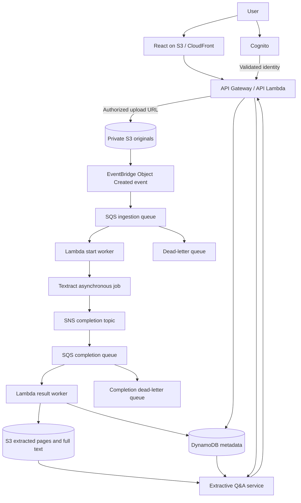

# Proposed AWS Architecture for Prashn

**Status:** Design proposal, 9 October 2026. No resources are deployed by this document. Custom model training and hosting remain deferred.

## Purpose

The AWS phase should demonstrate asynchronous document processing, independently scalable workers, persistent storage, recovery, access control and monitoring. A deployment architecture describes how services interact. Terraform expresses that design as infrastructure as code; it does not replace the application or its cloud adapters.

## Proposed service flow

SNS and the completion queue are part of this proposal because multipage Textract jobs complete asynchronously. Start the job, persist its ID, then retrieve all result pages after completion notification instead of holding a worker open. AWS documents the Start/Get and SNS completion pattern in its [Textract asynchronous operations guide](https://docs.aws.amazon.com/textract/latest/dg/api-async.html).

## Responsibilities and implementation work

| Service | Responsibility | Required project changes |
| --- | --- | --- |
| S3 / CloudFront | Static frontend hosting and private document objects | Build/deploy frontend, private origin, CORS and routing configuration |
| Cognito | User authentication | Replace local auth flow; map validated subject to application owner ID |
| API Gateway / Lambda | Authorize requests, create records, serve status/Q&A | Adapt Express routes or implement handlers; validate identity and ownership |
| S3 | Originals, page content and extraction outputs | Implement `StorageProvider`, scoped object keys, upload finalization and cleanup |
| EventBridge / SQS | Route upload events and buffer work | Durable job payloads, queue policies, retry and DLQ configuration |
| Worker Lambda | Start extraction and collect results | Replace in-process queue, store job/generation IDs, normalize page provenance |
| Textract | Managed OCR and document analysis | Select text/forms/tables or expense operations; map results to existing data contract |
| DynamoDB | Document status, references, owned metadata and chat | New repositories, indexes/access patterns, conditional writes and pagination |
| CloudWatch | Logs, operational metrics and alarms | Correlation IDs, latency/error metrics, queue age and DLQ alarms |
| IAM | Service access control | Least-privilege roles and resource policies |
| Terraform / GitHub Actions | Reproducible infrastructure and delivery | Modules, environments, CI validation and deployment pipeline |

Cloud storage alone does not make the current SQLite/local-queue backend scale across instances. These changes are necessary before distributed deployment. Full extraction output belongs in S3, with references and bounded metadata in DynamoDB; DynamoDB's item size limit is 400 KB. See [AWS guidance on large items](https://docs.aws.amazon.com/amazondynamodb/latest/developerguide/bp-use-s3-too.html).

## Reliability design

Use stable document IDs and a processing generation number. Associate each queued job and Textract job ID with the owned record. Workers should claim and update jobs using conditional writes, tolerate repeated events, and reject results from an older generation after reprocessing or deletion.

Configure SQS visibility timeouts and bounded retries. Route exhausted work to a DLQ, report a meaningful failed state, and provide controlled replay. Completion handling must paginate Textract results and retain the complete text and page provenance. Lambda/SQS delivery can repeat messages, so processing must be idempotent; see [AWS Lambda with SQS](https://docs.aws.amazon.com/lambda/latest/dg/with-sqs.html).

Keep originals private. Signed object URLs should be short lived and issued only after ownership checks. Upload finalization should confirm the expected key and size. Restrict object-created events to original uploads to avoid processing output objects again.

## Scaling and monitoring

API requests and document jobs scale separately. Limit worker concurrency against extraction quotas and budget. A backlog can be observed through queue age and message count; completed throughput, failure rate and end-to-end duration show whether capacity meets demand. The frontend may continue polling the owned document status API initially.

A project demonstration should measure behavior rather than merely name services:

| Demonstration | Evidence to collect |
| --- | --- |
| Concurrent uploads | Upload latency, queue depth, worker concurrency and processing duration |
| Worker failure | Retry behavior, failed state and DLQ entry |
| Duplicate event | One accepted result per processing generation |
| Tenant isolation | Another user cannot read the object, status or conversation |
| Full-content preservation | Original and complete page text remain retrievable |
| Observability | Correlated logs, metrics and actionable alarms |
| Repeatable deployment | Infrastructure plan/apply and teardown procedure |

## Cost and model decision

No custom inference endpoint is required for this architecture. Textract is a managed extraction service; the proposed answerer can remain the current lightweight implementation.

Cloud resources can still incur charges for extraction, storage, requests, compute and data transfer. Actual cost depends on region, usage and selected features; no zero-cost deployment is promised. Check [AWS pricing](https://aws.amazon.com/pricing/) when defining the deployment budget. Set budget notifications, bounded concurrency and data retention, and document teardown. Budget notifications should not be treated as a hard spending cap.

## Suggested deployment sequence

1. Define data contracts, ownership rules, processing generations and acceptance metrics.
2. Build S3 and DynamoDB adapters and Cognito integration.
3. Implement SQS ingestion and Textract start/completion workers with DLQs.
4. Deploy one development environment using Terraform and validate an end-to-end document.
5. Add CloudWatch alarms and automated build/deployment checks.
6. Run concurrent-upload, recovery, duplicate-event and access-control demonstrations.

A successful local workflow remains the prerequisite. This proposal does not claim that the cloud migration is implemented or that the local application's single-process recovery provides cloud fault tolerance.
