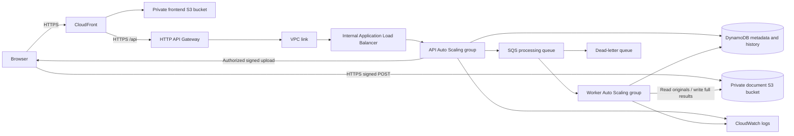

# Prashn AWS migration and deployment

Prepared on **10 October 2026 (Asia/Kolkata)**. The cloud application code and deployment files are implemented and tested locally. **The new managed-storage/scaling stack has not completed deployment or acceptance in AWS.** An owner-run attempt created infrastructure and started both services, then rolled back after missing readiness signals; see [the rollout evidence](aws-migration-test-report.md#aws-rollout-and-readiness-signal-correction). The existing [EC2 installation](ec2-deployment.md) continues to use its original compiled application, SQLite and local storage.

## Architecture supplied by this change



API servers and workers use the same release with separate entry points and workload roles. Workers retain the existing local PDF extractor, bundled English OCR, classifier and field extraction. Authentication retains bcrypt and JWT; Cognito and Textract are not part of this deployment. The document-processing pipeline is driven by durable SQS jobs; the UI/API interaction remains HTTP request/response.

Public browser and origin connections use HTTPS. API Gateway reaches the internal load balancer and API instances over HTTP inside the VPC. Instances have public IPs for outbound package downloads, AWS access and SSM, but no internet-facing inbound security-group rules. No NAT gateway, SSH ingress or purchased domain is provisioned. The website uses a stable AWS-provided CloudFront hostname.

## Application changes

- Storage supports local mode or S3. Originals are private; an owned API request issues a 120-second signed download. Extraction downloads a private temporary copy and removes it afterward.
- DynamoDB repositories replace SQLite for users, documents, questions and activity in AWS mode. Email ownership is reserved transactionally. Document lookups verify the owner, and question pairs use a document ownership/state condition.
- Full page text, fields, line items and complete extracted text reside in S3 result objects, avoiding DynamoDB's [400 KB item limit](https://docs.aws.amazon.com/amazondynamodb/latest/developerguide/bp-use-s3-too.html). Q&A hydrates the selected document's evidence from its result reference.
- Direct signed S3 POSTs preserve the 10 MiB file limit and frontend batch selection without sending file bytes through [API Gateway's 10 MB payload limit](https://docs.aws.amazon.com/apigateway/latest/developerguide/http-api-quotas.html). The server verifies accepted size, type, ownership and file signature. It copies staging into an immutable original before queueing; reusing an upload URL cannot overwrite that original.
- A DynamoDB outbox recovers committed uploads after dispatch failure or API interruption, and retains sent entries until terminal commit so lost/expired deliveries remain recoverable. Inactive uncompleted sent jobs become eligible for redispatch after fifteen minutes. Repeated worker interruptions become recorded failures after the bounded attempt limit. Workers use generation numbers, expiring leases, heartbeat renewal and conditional commits. Duplicate deliveries, expired workers and old retry generations cannot overwrite current results. These controls account for [SQS at-least-once delivery](https://docs.aws.amazon.com/AWSSimpleQueueService/latest/SQSDeveloperGuide/standard-queues-at-least-once-delivery.html).
- Permanent unreadable-input failures are recorded. Temporary failures are retried; exhausted transient failures remain for queue redrive. Deletion marks a tombstone before cleanup, blocking new questions and late worker writes. Cleanup removes original/results/history, retaining minimal tombstones and activity under the audit policy.
- Workers recover expired upload intents and interrupted deletions. Daily reconciliation removes unreferenced results older than 24 hours while retaining current or actively leased outputs. Previous immutable results are retained briefly for in-flight readers.
- HTTP/job logs omit request bodies, tokens and document text. CloudWatch Agent collects application logs and memory/disk metrics; API Gateway writes request/status access logs. Infrastructure includes queue, dead-letter and API-error alarms. Alarm notifications are not configured; alarms are visible in CloudWatch.
- The frontend upload service selects the appropriate backend mode. Existing routes, screens and styles are retained.

## Files and entry points

| File | Purpose |
| --- | --- |
| `deploy.sh` | Read-only preflight or explicit deployment; builds/tests/packages the release |
| `infra/template.json` | Reviewable generated CloudFormation stack |
| `infra/build_template.py` | Deterministic template generator; does not call AWS |
| `infra/artifacts.json` | Separate private, retained release-artifact bucket |
| `infra/bootstrap.sh` | Fresh Ubuntu instance installation, service and CloudWatch setup |
| `infra/verify-native.sh` | Native dependency smoke checks; rebuilds an incompatible SQLite binary on Linux |
| `infra/signal-ready.sh` | IMDSv2 instance ID and creation/update-only CloudFormation readiness handshake |
| `infra/tests/test_signal_ready.py` | Stubbed handshake regression checks; no AWS or metadata network requests |
| `backend/src/worker.ts` | Standalone SQS worker |
| `backend/src/migrate.ts` | Read-only snapshot validation; explicit import with `--apply` |
| `backend/src/reconcile.ts` | Read-only orphan review; explicit cleanup with `--apply` |
| `infra/cloud_command.py` | Loads stack configuration and an in-memory private signing secret for operator commands |
| `backend/tests/aws-integration.test.cjs` | Real SDK/API/worker tests against a local Moto server |

Use the complete `local/local/local` mode tuple or `s3/dynamodb/sqs`. Partial mixtures are rejected to prevent a scaled deployment from retaining an instance-local database or queue. AWS mode requires `AWS_REGION`, `DOCUMENT_BUCKET`, `DYNAMODB_TABLE` and `PROCESSING_QUEUE_URL`. Deployed workloads obtain AWS credentials from IAM roles. A random signing secret is stored in SSM SecureString and written privately on each instance at bootstrap; it is not put in frontend assets, Git or CloudFormation outputs.

## Scaling and account checks

Each group starts with one t3.small instance and permits two by default. API target tracking uses **100 ALB requests/minute per target**. Workers add capacity after at least three visible jobs persist for two minutes, and reduce capacity after the queue has no visible or in-flight jobs for ten minutes. Warmup is 300 seconds. Actual demand, provisioning latency and provider metrics determine when these policies act; scaling has not been demonstrated live.

The owner supplied read-only `us-east-1` results: load balancers `0`, HTTP APIs `0`, and Standard On-Demand EC2 quota **16 vCPUs**. The planned default maximum needs eight new vCPUs plus the known existing two. These checks show listing access and quota headroom, not permission to create every resource on the personal Free plan. Deployment preflight repeats the checks and counts currently running instances.

## Cost review before apply

The minimum fleet runs **two new instances**, an ALB, two 20 GiB gp3 disks and two public IPv4 addresses, plus request/storage/logging services. A planning estimate is **roughly $60/month for baseline infrastructure**, before variable requests, load-balancer capacity, storage growth, taxes, credits and the existing server. Scaling to four instances adds compute, disks and addresses. This is an estimate, not an account-specific quote. Review [EC2 T3 pricing](https://aws.amazon.com/ec2/instance-types/t3/), [ALB pricing](https://aws.amazon.com/elasticloadbalancing/pricing/) and [public IPv4 pricing](https://aws.amazon.com/vpc/pricing/), and calculate the chosen region/workload in the [AWS Pricing Calculator](https://calculator.aws/).

This exceeds the current $10 monthly alert amount if run continuously. Alerts are not a cap; eligible usage consumes credits. The script does not upgrade the account plan. Free-plan access or service quotas may still block resource creation.

## Deployment procedure

Run the script in **prashn-admin CloudShell or another authenticated Linux environment**, from the approved source revision. It requires AWS CLI, compatible Node/npm, Python 3, Bash, tar and curl. It does not run directly as a PowerShell script. Install Node 22 in that shell if its runtime does not satisfy the preflight check.

SQLite remains a dependency for local regression tests and reading an old SQLite snapshot during migration. The cloud database is DynamoDB; the cloud server does not initialize a SQLite database. Some downloaded SQLite binaries require a newer glibc than CloudShell provides. After dependency installation, `infra/verify-native.sh` checks SQLite, rebuilds it from source on Linux if loading fails, and exercises an in-memory SQLite query, canvas and bcrypt. Any rebuild or final smoke-check failure stops deployment before provisioning. This follows the [SQLite module's source-build procedure](https://github.com/TryGhost/node-sqlite3) and requires the [node-gyp Unix toolchain](https://github.com/nodejs/node-gyp): Python, make and a C++ compiler. Fresh Ubuntu instances already install those tools and run the same native check before service setup.

If the CloudShell toolchain is missing, install it in CloudShell before applying:

```bash
sudo dnf install -y gcc-c++ make python3
```

First inspect the template and run:

```bash
export AWS_REGION=us-east-1
export EXPECTED_ACCOUNT=683146427271
bash deploy.sh plan
```

Plan makes read-only AWS calls and validates the template. It does not create stacks, roles, queues, instances or buckets. Successful preflight is not live acceptance.

After reviewing costs, account service access and the changes:

```bash
bash deploy.sh apply
```

Apply asks for the account ID before creating resources and requires a clean committed source tree. Explicitly approved noninteractive automation can use `PRASHN_APPROVE_DEPLOY=yes`. It runs the stubbed readiness tests, installs locked dependencies, builds the frontend, runs local backend regression tests, packages compiled backend files without secrets/native Windows modules, provisions the artifact and application stacks, publishes static files and checks HTTPS health. Fresh Ubuntu instances install their own production dependencies. Bootstrap verifies the release archive checksum and signals initial/rolling deployment readiness using its EC2 instance ID retrieved through IMDSv2, as required by [the CloudFormation signal API](https://docs.aws.amazon.com/AWSCloudFormation/latest/APIReference/API_SignalResource.html). It skips late signals during rollback or ordinary scale-out of a completed stack. Startup and signal output is collected in `/var/log/prashn/bootstrap.log` and sent to the application log group under `{instance_id}/bootstrap`; tokens and environment-file contents are not printed. A release manifest records the Git revision; deployed health exposes that revision through `release`.

Use a terminal multiplexer to preserve the process during an ordinary connection loss, and retain a deployment log. A full CloudShell environment shutdown can still stop the process. In CloudShell:

```bash
sudo dnf install -y tmux
tmux new -s prashn-deploy
```

Inside that session, from the repository folder:

```bash
mkdir -p .aws-build
set -o pipefail
EXPECTED_ACCOUNT=683146427271 AWS_REGION=us-east-1 bash deploy.sh apply 2>&1 | tee .aws-build/deploy.log
```

After reconnecting, `tmux attach -t prashn-deploy` reattaches to the session if it still exists. Check the process and stack before starting a second deployment.

For recovery from the observed `prashn-cloud` **ROLLBACK_COMPLETE**, preserve the failed stack and its retained logs/data resources while diagnosing. Use the corrected release with `PRASHN_STACK=prashn-cloud-v2` for a separate retry, avoiding the old retained log-group names. This creates new resources and does not reuse or migrate data from the failed attempt. The script supports a custom name; the same name must be supplied on every later update. Review the old attempt's retained buckets/table/logs and artifact stack for deliberate cleanup after successful verification; they are not removed by the retry.

The existing instance is neither adopted nor modified. Deployment outputs are saved to ignored `.aws-build/outputs.json`. The browser URL and health modes must show the new stack; a successful health check does not establish all features or scaling. Do not switch users to the new website until live acceptance and any required data import are verified.

## Existing data migration

Import is an explicit operation, not an automatic side effect of deployment. Make a private, consistent snapshot with this layout:

```text
snapshot/
  prashn.db
  uploads/       original files using their existing storage keys
  processed/     complete extracted .txt outputs
```

Pause uploads/processing and stop the old backend before taking the snapshot. Use SQLite's backup API to capture committed WAL contents, then copy both storage directories while the backend remains stopped. Protect the snapshot directory/archive with owner-only permissions. Transfer it through an authenticated encrypted channel or private encrypted storage; do not publish it in the frontend/artifact bucket. Keep the original files and a separate backup. The old server's compiled application and environment should remain available for rollback.

Prepare the new backend dependencies/build on the authenticated operator machine, then validate without writing:

```bash
python3 infra/cloud_command.py migrate prashn-cloud --snapshot /private/snapshot
```

The validator checks ownership, identity collisions, structured JSON, source paths and original checksums before import. It never merges accounts by matching email alone. Review the record counts and resolve any collision without changing ownership incorrectly. For the consistent final cutover, pause both new Auto Scaling groups at desired/minimum zero through the operator's AWS controls before applying the import; this is deliberate maintenance, not the normal stack setting.

```bash
python3 infra/cloud_command.py migrate prashn-cloud --snapshot /private/snapshot --apply
```

The importer reads SQLite read-only, preserves user IDs/password hashes, uploads originals and full evidence, imports ordered history/activity and verifies target ownership/checksums. Retry against the same unchanged source can resume an interrupted import without duplicating imported history. S3 and DynamoDB do not share a transaction; an interrupted import can leave partial target state, so do not accept users until verification succeeds. Restore the groups to minimum/desired one afterward. Pending or legacy records without page evidence are dispatched for reprocessing.

Verify migrated login, document counts, representative original bytes, fields, page text, citations and history before cutover. New-domain users sign in again. Do not rerun an old snapshot to overwrite subsequent user changes or intentionally deleted records. Keep the old installation and snapshot until rollback/restore has been exercised. Actual production data has not been copied or imported during preparation.

## Local validation

Normal mode remains available:

```bash
cd backend
npm test
```

AWS tests create only local emulator resources, use explicit fake credentials and restrict endpoint overrides to loopback:

```bash
python3 -m venv .test-output/aws-venv
.test-output/aws-venv/bin/python -m pip install -r tests/aws-test-requirements.txt
npm run test:aws
```

On Windows use `.test-output\aws-venv\Scripts\python.exe` for installation; the test runner selects the matching default Python path. `MOTO_PYTHON` can select another isolated Python interpreter. Moto is a test dependency, not installed on production instances.

Infrastructure validation:

```bash
python3 infra/build_template.py
cfn-lint infra/template.json infra/artifacts.json
bash -n deploy.sh
bash -n infra/bootstrap.sh
bash -n infra/verify-native.sh
bash -n infra/signal-ready.sh
python3 -m unittest discover -s infra/tests -v
```

See [the preparation verification report](aws-migration-test-report.md) for executed results and limits.

## Live acceptance still required

1. Confirm stack creation, workload roles, private buckets, encrypted disks and actual CloudWatch log delivery.
2. Register/login, verify invalid/expired tokens, and exercise two-user isolation across details, downloads, Q&A, history, retry and deletion.
3. Upload PDF, PNG, JPEG, corrupt/spoofed input and a mixed batch. Verify actual values for distinct vendors/totals, all page text and missing-evidence refusal. Test the full 10 MiB boundary through the browser.
4. Stop/restart or replace an API instance and a busy worker. Verify persistent documents/history and recovery without conflicting results. Demonstrate dead-letter redrive and operational diagnosis.
5. Generate controlled legitimate API/processing demand. Inspect scaling activities, instance counts, queue metrics and scale-in, then verify data after replacements. Policy existence is not proof of scaling.
6. Inspect rendered navigation, upload progress, previews, long histories, mobile layout and error states on the new URL.
7. Verify real snapshot import, backup restoration and rollback. Check actual costs/credits and remove unused compute only after data verification.

## Remaining limits

- Owner queries use an eventually consistent secondary index, followed by strong ownership reads. New list entries can briefly lag. API list/history responses still return all records; paging and large-account performance need further work.
- Very large hydrated document/Q&A responses can encounter API Gateway's response limit even though full evidence is safely retained in S3. Page-level API pagination is not implemented.
- Signed downloads are temporary bearer capabilities: copying an issued URL can allow access until expiry. Issuance remains owner-authorized. Upload staging URLs last ten minutes; staging objects expire after one day.
- Deletion, queueing and S3 writes cross service boundaries. Fences, outbox recovery and reconciliation cover tested cases, but crash/provider outage tests must be repeated in AWS. Reconciliation is conservative and runs daily; manual orphan inspection is available through `cloud_command.py reconcile` before `--apply`.
- Metrics report configured concurrency per worker, not a live cluster-wide worker count. Scaling policies and logs require live observations to verify resource behavior.
- DynamoDB point-in-time recovery is configured; coordinated S3/database restore has not been demonstrated. Data, frontend buckets, artifacts and log groups are retained on stack removal and can continue to incur charges. The SSM secret is managed by the script outside the main stack.
- Do not stop individual ASG instances as a cost-control method: the group can replace them. For a temporary pause, intentionally reduce group minimum/desired capacity; ALB and retained storage still incur charges. Review a deliberate stack teardown separately from data deletion.
- Development/build dependency advisories remain. Password recovery, token revocation, per-user/IP abuse controls, a complete production security review and CI/CD are not included. API Gateway's configured throttling is a service-level control.

**Preparation verdict: locally tested and ready for a reviewed AWS rollout. Live AWS deployment, scaling, logging, browser acceptance and production data migration remain unverified.**
