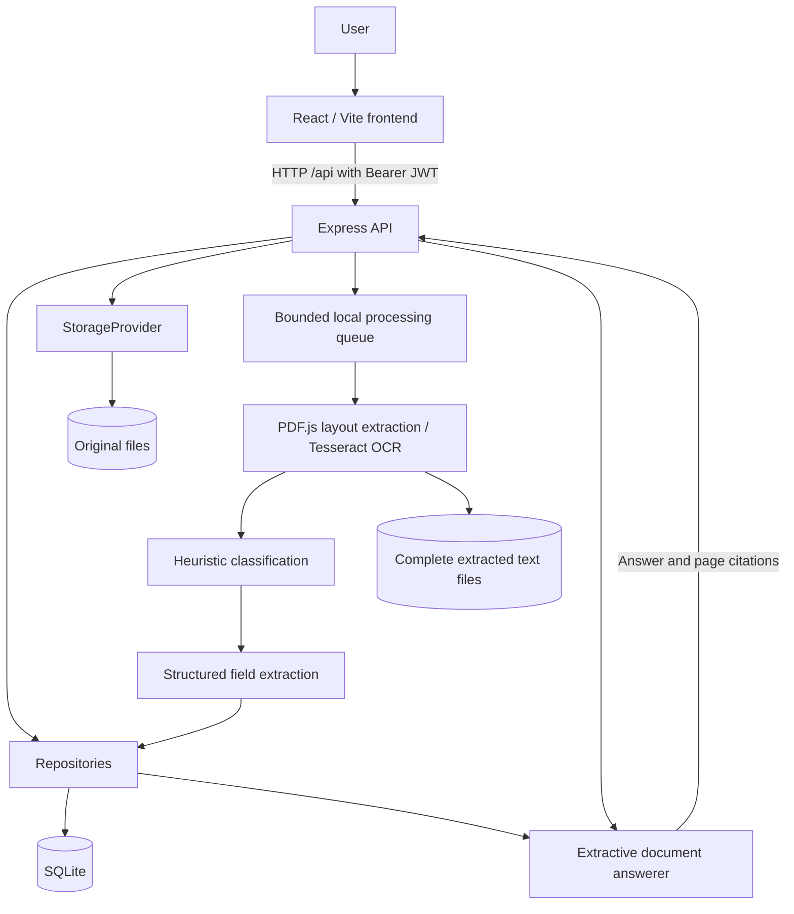

# Prashn: Project Documentation

**Project topic:** Cloud-Native Intelligent Document Processing and Question Answering Platform  
**Status date:** 9 October 2026  
**Current scope:** Local application; custom model training and cloud deployment are deferred.  
**Repository:** https://github.com/gayas-sheik/Prashn  
**Working checkout:** `Prashn-latest`; application repairs build on upstream commit `a15b25b`.

## 1. Abstract

Prashn allows authenticated users to upload PDFs and images, extract readable text, inspect structured information, and ask questions grounded in a selected document. The local implementation combines a React interface, an Express API, SQLite, filesystem storage, native PDF extraction and Tesseract OCR. It preserves the original upload and complete extracted content, rather than retaining only recognized fields.

The cloud computing objective is to evolve this workflow into an asynchronous AWS system with durable object storage, message queues, independent processing workers, monitoring and infrastructure as code. Those cloud capabilities are a proposed next phase; they are not deployed in the current application.

## 2. Problem and objectives

Invoices, receipts and forms contain useful information that users otherwise read manually. PDF drawing order, scanned pages and varied layouts make extraction difficult. A successful application must preserve evidence, associate labels with the right values, and refuse questions for which evidence is absent.

The objectives are to:

- Accept supported documents and report upload and processing failures clearly.
- Extract digital PDF text and OCR scanned documents page by page.
- Identify document types and source-backed fields and line items.
- Preserve full text, page provenance and original files.
- Answer supported questions with citations to the selected document.
- Isolate users' documents, conversations and activity.
- Provide an architecture that can later support cloud storage and distributed processing.

## 3. Scope and current capabilities

| Area | Current behavior | Practical limit |
| --- | --- | --- |
| Accounts | Registration, login, JWT session restoration and logout | No password reset, MFA or token revocation workflow |
| Upload | PDF, PNG and JPEG; single and batch API uploads; automatic result tracking | 10 MiB per file; UI and batch API maximum 20 files |
| Processing | Bounded background queue, status reporting, retry and startup recovery | Queue operates within one backend process |
| Extraction | Native PDF reading order reconstruction; real English OCR for images/scanned pages | Unfamiliar layouts, low quality scans and handwriting need review |
| Classification | Invoice, Receipt, Form, Contract or Unknown | Keyword heuristics, not a trained classifier |
| Structured data | Common labels, explicit key/value and column pairs, supported line item tables | No guarantee that every field or complex table will be recognized |
| Q&A | Fields, supported cost/date phrasing, named/ordinal items, summaries and matching passages | Limited paraphrases, reasoning and follow-up understanding |
| Document management | Original preview/download, full text, reprocessing and deletion | No document editing or version management |
| Dashboard | Actual user document counts, processing states and activity | No live AWS telemetry |
| Settings | Theme preference | Other unfinished controls are read-only/planned |
| Cloud | Interfaces and migration plan | AWS adapters and deployment are not implemented |

No custom ML model or Ollama service is required for the selected mode. Tesseract itself uses existing trained OCR language data; this is different from training or hosting a new document/Q&A model.

## 4. Local architecture



The frontend calls `/api`. Vite proxies these requests to the backend during local development. Controllers validate requests and ownership; repositories manage database access; the processing service orchestrates extraction; the storage interface handles files. These boundaries support future replacement of local services, but migration still requires implementation and testing.

## 5. Technology and repository map

| Component | Technology / location |
| --- | --- |
| Frontend | React, TypeScript, Vite, React Router, Tailwind CSS; `src/` |
| Backend | Node.js, Express, TypeScript; `backend/src/` |
| PDF text/layout | `pdfjs-dist`, `pdf.layout.ts`, `local.extractor.ts` |
| PDF rendering and image inspection | `pdf-parse` |
| OCR | `tesseract.js`, bundled `@tesseract.js-data/eng` |
| Authentication | bcrypt password hashes and signed JWTs |
| Database | SQLite via `sqlite` and `sqlite3` |
| Original storage | `backend/storage/uploads/` by default |
| Complete extraction | `backend/storage/processed/[document-id].txt` |
| Regression tests | `backend/tests/workflow.test.cjs`, generated fixtures |

Key frontend modules are `src/context/AuthContext.tsx`, `src/services/api/`, the Upload, DocumentDetails and DocumentQA pages, and `OriginalDocumentPreview.tsx`. Backend routes, controllers, repositories, processing and storage each have their own directories.

## 6. Processing workflow

1. Authenticate and upload a supported file. The backend saves the original and creates an owned document record.
2. Queue the job. Default concurrency is two documents; pending work can be recovered after restart.
3. Read PDF text using page coordinates so visually adjacent labels and values remain associated even when PDF drawing instructions have a different order.
4. OCR images and detected scanned PDF pages. `OCR_MODE=always` can force OCR when a PDF's selectable text layer is incomplete.
5. Classify the extracted content and extract supported fields and line items without substituting invented amounts or currency.
6. Save full text, individual page content, extraction method, field provenance, a file checksum and processing metadata.
7. Mark the document completed and record activity. On errors, retain a failure reason and allow retry.

The normal backend states are `Uploaded`, `Queued`, `Processing`, `Classifying`, `Extracting information`, then `Completed`. Errors produce `Failed`. Upload success is separate from processing completion.

Empty/unreadable documents, corrupt PDFs and protected PDFs produce errors. The default PDF page limit is 100. Successful extraction does not establish that every character or field is accurate.

## 7. Q&A behavior

Questions are evaluated against the selected user's completed document. The answerer checks structured fields and line items, then searches the preserved page text for relevant passages. A citation identifies the source filename, page, section and supporting snippet.

Examples of supported requests include:

- “What is the total amount?”, “What is the cost?” and “How much is it?”
- “What is the invoice number?” and “What is the date provided?”
- “What is the payment method?” and “How much was paid?” when those facts are present.
- “How many laptops were purchased?” and “What is the second item's price?” for recognized line items.
- “Summarize this document” and questions matching an explicit field or source passage.

An invoice total does not establish payment status. A tax rate is distinct from a tax amount; a GST identifier is distinct from tax. When multiple recognized values match a question, the answer can list the values and their pages rather than choosing one silently.

If evidence is missing, the response is: **“I couldn't find that information in this document.”** Conversation messages are persisted. Explicit page follow-ups such as “And on page 3?” and unambiguous party references such as “What is their phone number?” use the preceding successfully cited turn. Ambiguous references such as “and the other one?” still refuse. Conversation context selects a source page or party; answers remain grounded in the document. Documents with legacy records lacking page text must be reprocessed before Q&A.

## 8. Data model and persistence

| Entity | Stored information |
| --- | --- |
| `users` | ID, normalized email, password hash, full name, role and timestamps |
| `documents` | Owner, file metadata/storage key, status/type, page count, summary, checksum, failure reason, JSON fields/items/pages |
| `qa_messages` | Document and owner IDs, sender, text, timestamps and JSON citations |
| `activity_events` | Owner, document reference, event, status, actor, details and timestamps |

Each extracted page contains its page number, text, `text` or `ocr` method and optional OCR confidence. Fields and line items may contain their source page and snippet. Field confidence is a heuristic fraction; document classification and OCR scores use their respective percentage conventions. These values are not calibrated accuracy probabilities.

SQLite uses WAL, foreign keys and a busy timeout. Startup adds the page-content column to older schemas. Document deletion removes associated question messages and extracted text; deletion activity remains as an audit entry. Original files and database metadata both matter for restoration: back up the database and storage together while the backend is stopped, or use a SQLite-aware backup procedure.

## 9. Local setup and launch

Use Node.js and npm compatible with the locked dependencies. A recent Node.js LTS release is suitable; check package engine requirements when installing on another machine. The workspace has two folders: current work is in **`Prashn-latest`**, while the original `Prashn` folder was retained.

In PowerShell, install frontend dependencies:

```powershell
cd 'C:\Users\rithv\Downloads\Cloud_computing_project(Prashn)\Prashn-latest'
npm ci
```

Install and configure the backend:

```powershell
cd backend
npm ci
```

Create `backend/.env` from `.env.example` if no `.env` already exists. Set a private `JWT_SECRET` and keep `OLLAMA_MODEL=` empty. Do not overwrite an existing environment file containing local configuration.

Start the backend in one terminal:

```powershell
cd 'C:\Users\rithv\Downloads\Cloud_computing_project(Prashn)\Prashn-latest\backend'
npm run dev
```

Start the frontend in a second terminal:

```powershell
cd 'C:\Users\rithv\Downloads\Cloud_computing_project(Prashn)\Prashn-latest'
npm run dev
```

Open the URL printed by Vite, normally `http://localhost:5173`. Default backend health is `http://localhost:5000/api/health`. Register an account, log in, upload a document, wait for completion, inspect Full Text and extracted fields, then ask a question. `Ctrl+C` stops a terminal's server.

After a single-file upload, the upload screen tracks the actual processing status and automatically opens that document's results when it completes. For multiple files, completed fields, recognized line items and text previews appear directly on the upload screen. Each result also provides Full Results and Ask Questions actions. Processing failures remain visible with a retry action; upload success does not imply processing success. Polling requests are cancelled when leaving the page.

For a compiled backend, use `npm run build` then `npm start`. This server must be restarted after rebuilding. Frontend `npm run build` writes `dist/`; `npm run preview` serves a local build preview, not a production hosting configuration.

If testing on alternate ports, set `PORT` for the backend and `PRASHN_API_TARGET` for Vite. A session preview used frontend 5174 and backend 5050; these are not the application's default ports.

## 10. Configuration reference

| Variable | Default / purpose |
| --- | --- |
| `PORT` | Backend port, `5000` |
| `NODE_ENV` | `development`; production requires an explicit JWT secret |
| `JWT_SECRET` | Token signing secret; set a private value |
| `JWT_EXPIRES_IN` | `7d` |
| `CORS_ORIGIN` | `http://localhost:5173`; adjust for separately hosted frontend |
| `DB_FILE` | `data/development/prashn.db` relative to backend |
| `DATABASE_URL` | Legacy database path alias when `DB_FILE` is absent |
| `UPLOAD_DIR` | `storage/uploads` relative to backend |
| `PROCESSED_DIR` | `storage/processed` relative to backend |
| `PROCESSING_CONCURRENCY` | `2` |
| `MAX_DOCUMENT_PAGES` | `100` |
| `OCR_LANGUAGE` | `eng`; additional language data must be supplied |
| `OCR_LANG_PATH` | Optional local OCR language data directory |
| `OCR_MODE` | `auto`; `always` forces OCR on PDF pages |
| `OLLAMA_MODEL` | Empty for selected extractive mode; optional provider remains dormant |
| `STORAGE_MODE` | `local`; unsupported storage providers are rejected |
| `VITE_API_BASE_URL` | Frontend build-time API base; otherwise `/api` |
| `PRASHN_API_TARGET` | Vite proxy target; otherwise `http://localhost:5000` |

Other mode names in configuration are not evidence that cloud implementations exist. Setting a variable to `aws` does not deploy or implement an AWS adapter.

## 11. API reference

Prefix all paths with `/api`. Protected endpoints require `Authorization: Bearer <token>`; original-file access also requires that header. URL query tokens are not accepted.

| Method | Path | Authentication | Purpose |
| --- | --- | --- | --- |
| GET | `/health` | Public | Process health and selected Q&A mode |
| POST | `/auth/register` | Public | JSON `{email, password, fullName}`; returns registration acknowledgement |
| POST | `/auth/login` | Public | JSON `{email, password}`; returns `{token, user}` |
| GET | `/auth/me` | Required | Current user |
| POST | `/auth/logout` | Public | Acknowledgement; client drops token, no server-side revocation |
| GET | `/documents` | Required | Owned documents in `{documents}`; UI handles filtering/pagination |
| GET | `/documents/metrics` | Required | Actual user metrics in `{metrics}` |
| POST | `/documents/upload` | Required | Multipart `file`; returns `{document}` |
| POST | `/documents/upload-multiple` | Required | Multipart `files`; batch upload |
| GET | `/documents/:id` | Required | Owned document in `{document}` |
| GET | `/documents/:id/file` | Required | Original bytes, inline preview response |
| POST | `/documents/:id/retry` | Required | Queue owned document for reprocessing |
| DELETE | `/documents/:id` | Required | Delete document and related stored content |
| GET | `/documents/:id/questions` | Required | History in `{conversation}` |
| POST | `/documents/:id/questions` | Required | JSON `{question}`; assistant response in `{message}` |
| DELETE | `/documents/:id/questions` | Required | Clear persisted conversation |
| GET | `/activity` | Required | Owned activity events |

Questions must be nonempty strings of at most 4,000 characters. Registration requires a valid email, nonempty full name of at most 100 characters, and a password of at least eight characters and at most 72 UTF-8 bytes.

Common response codes are `400` for invalid input, `401` for invalid authentication, `404` for missing or unowned documents, `409` for an unready document or missing legacy page content, `413` for excessive file size, and `415` for unsupported upload type. Errors normally use `{error: "message"}`. Health returning `ok` is not a complete storage/database readiness assessment.

## 12. Security and operational boundaries

Passwords are hashed, JWTs authorize protected routes, and owner checks protect document, chat and activity lookups. The frontend fetches original bytes with authentication and creates a temporary blob preview. Chat text is rendered through React rather than inserted as HTML.

The current local app is not a completed production security implementation. JWTs are held in browser local storage, logout does not revoke issued tokens, and account recovery, rate limiting, malware scanning and a comprehensive production review remain future work. Keep `.env`, private uploads, databases and generated test artifacts out of commits. Preserve interface boundaries and full extracted content when extending the app.

## 13. Validation and known issues

The latest completed run passed **24 backend regression tests**. The synthetic HTTP benchmark also passed 72 expected-field checks and 73 Q&A checks, including all 61 positive-answer citation checks and 12 missing-evidence refusals. See [the synthetic evaluation and browser report](synthetic-evaluation-report.md) for the before/after comparison and grading limits. Frontend production build and lint also passed; lint reports React advisory warnings. Coverage includes digital/mixed/scanned PDFs, PNG/JPEG OCR, rotated scans, currency preservation, source citations, field disambiguation, generic columns, multiline addresses, classification boundaries, authentication isolation, upload limits, retry, deletion and recovery. Additional cases cover varying page counts, repeated invoice/receipt/form/generic fields and persisted multi-invoice answers before and after reprocessing. One optional-provider contract test uses mocked responses; it installs or calls no model.

Run from the backend:

```powershell
npm test
```

Run from the repository root:

```powershell
npm run build
npm run lint
```

Fixtures and test databases are generated under `backend/.test-output/`. A separate HTTP smoke test exercised the frontend proxy and backend workflow. Earlier browser visual and interactive QA was unavailable. A subsequent Brave pass verified single/batch upload results, failed-processing retry, PDF preview, persisted chat scrolling, a 390 x 844 emulated phone layout and session expiry. Passing these checks does not prove perfect extraction for arbitrary documents or correctness in other browsers.

A reported invoice defect involved PDF values appearing before labels in drawing order. Reading-order reconstruction and ordinary cost/date matching were corrected. The previously uploaded invoice was reprocessed in an earlier pass. Later column-field enhancements passed generated regression cases but were not reapplied to that stored invoice before development was paused. The static backend session may still run the earlier build until restarted; existing records require Reprocess to use newer extraction behavior. Original files and chat history were preserved.

A subsequent screenshot revealed a runtime mismatch: Vite served `Prashn-latest`, while port 5000 ran the older sibling `Prashn` backend. That verified older backend was stopped and the latest compiled backend started. A SQLite backup was retained under the ignored test-output directory. Local environment paths now retain the original database and file storage, and the screenshot's document was reprocessed successfully. Its invoice number, date and total were checked against the corrected extraction; original bytes and conversation history remained intact. Runtime health now reports the workspace name and extraction version to help identify a stale backend.

See [the detailed validation report](local-mvp-test-report.md) and [the proposed AWS architecture](aws-architecture.md).

## 14. Delivery roadmap

1. Restart the latest compiled backend and reprocess affected existing documents; extend the completed Brave browser pass to other browsers, physical devices and interruption scenarios.
2. Expand a representative, anonymized document evaluation set and record extraction accuracy and answer correctness by layout.
3. Implement the AWS storage, repository, authentication and durable queue adapters.
4. Deploy reproducible infrastructure, monitoring, retry/DLQ handling and resource limits.
5. Demonstrate concurrent uploads, duplicate-event handling, recovery and tenant isolation in AWS.

Custom model development remains deferred. The cloud computing project can demonstrate storage, serverless processing, queueing, fault tolerance and monitoring while keeping the application answerer extractive.
